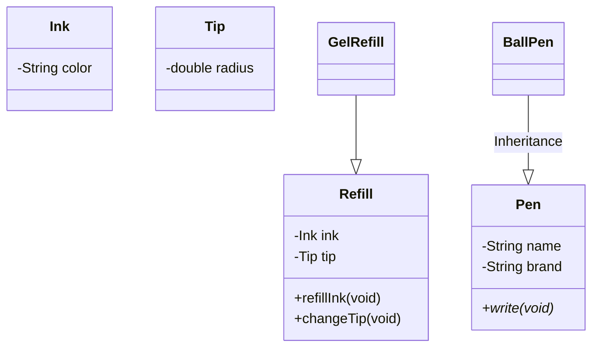

---
 Pen example
---

```mermaid
classDiagram
class Pen
Pen : -String name
Pen : -String brand
Pen : +write(void)*

class Refill
Refill : -Ink ink
Refill : -Tip tip
Refill : +refillInk(void)
Refill : +changeTip(void)

class Ink
Ink : -String color

class Tip
Tip : -double radius

GelRefill --|> Refill

BallPen --|> Pen : Inheritance


```
